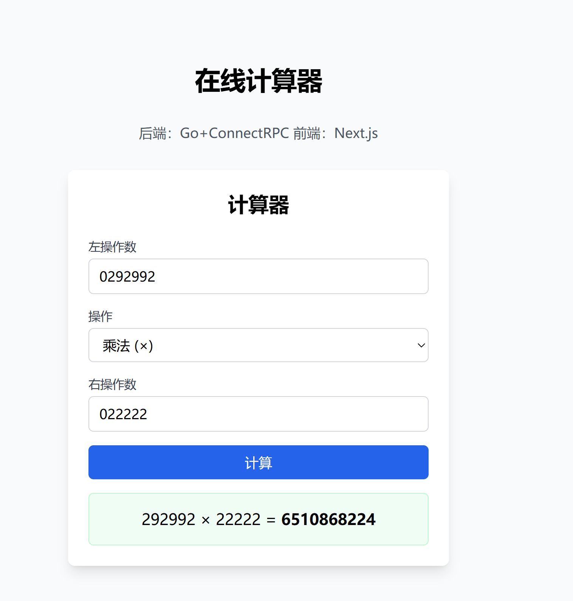

# 全栈计算器应用

这是一个全栈计算器应用，使用 Go + ConnectRPC 构建后端服务，Next.js 构建前端界面。应用支持基本的加减乘除运算，并通过 ConnectRPC 协议进行前后端通信。



## 项目结构

```
.
├── backend/                # Go后端服务
│   ├── api/                # Proto API定义（主要定义）
│   ├── cmd/                # 主命令入口
│   │   └── server/         # 服务器实现与测试
│   ├── gen/                # 生成的代码（运行buf generate后生成）
│   ├── internal/           # 内部实现
│   │   └── service/        # 服务实现与测试
│   ├── buf.gen.yaml        # Buf生成配置
│   ├── buf.work.yaml       # Buf工作空间
│   └── go.mod              # Go模块定义
└── frontend/               # Next.js前端应用
    ├── src/                # 源代码
    │   ├── app/            # Next.js应用
    │   ├── components/     # React组件及测试
    │   ├── gen/            # 生成的ConnectRPC代码
    │   └── lib/            # 工具库及测试
    ├── proto/              # Proto定义（从后端同步）
    ├── public/             # 静态资源
    ├── buf.gen.yaml        # 前端Buf生成配置
    ├── buf.work.yaml       # 前端Buf工作空间
    ├── jest.config.js      # Jest配置
    ├── jest.setup.js       # Jest设置
    ├── next.config.js      # Next.js配置
    └── package.json        # 依赖配置
```

## 技术栈

### 后端

- Go 语言
- ConnectRPC（基于 gRPC 的 HTTP/JSON API）
- Protocol Buffers
- buf 工具
- Go 测试框架

### 前端

- Next.js
- React
- TypeScript
- ConnectRPC Web 客户端（@bufbuild/connect-web）
- Protocol Buffers TypeScript 支持（@bufbuild/protobuf）
- Tailwind CSS
- Jest 和 React Testing Library 测试框架

## 环境要求

- Go 1.21+
- Node.js 18+
- npm 8+
- buf 工具（用于代码生成）

## 安装和运行说明

### 第一步：克隆仓库

```bash
git clone https://github.com/lunhuishi825/calculator.git
cd calculator
```

### 第二步：设置和运行后端服务

1. 安装必要的 Go 依赖：

```bash
cd backend
go mod tidy
```

2. 生成 Protocol Buffers 代码：

```bash
# 确保已安装buf工具：https://buf.build/docs/installation
buf generate
```

3. 运行后端服务：

```bash
go run cmd/server/main.go
```

后端服务将在 http://localhost:8081 上运行。如果看到以下消息，表示服务启动成功：

```
启动服务器，监听地址：localhost:8081
```

### 第三步：设置和运行前端应用

1. 安装 Node.js 依赖：

```bash
cd frontend
npm install
```

2. 安装 Connect 相关依赖（如果缺少）：

```bash
npm install @bufbuild/connect @bufbuild/connect-web @bufbuild/protobuf
npm install --save-dev @bufbuild/buf @bufbuild/protoc-gen-connect-web@^0.11.0 @bufbuild/protoc-gen-es@^1.4.1
```

3. 同步 Proto 文件并生成代码：

```bash
# 确保前端Proto定义与后端一致
cp -r ../backend/api/* ./proto/
# 生成前端客户端代码
npx buf generate
```

4. 启动开发服务器：

```bash
npm run dev
```

前端应用将在 http://localhost:3000 上运行。

## 使用说明

1. 确保后端服务和前端应用都已启动
2. 在浏览器中访问 http://localhost:3000
3. 在计算器界面中：
   - 输入左操作数
   - 选择操作类型（加法、减法、乘法或除法）
   - 输入右操作数
   - 点击"计算"按钮
4. 计算结果将显示在界面上

## ConnectRPC 协议介绍

本项目使用 ConnectRPC 进行前后端通信。ConnectRPC 是一种现代化的 RPC（远程过程调用）框架，具有以下特点：

- **兼容 gRPC**：提供与 gRPC 兼容的 API，但更容易集成到 Web 应用中
- **双向类型安全**：使用 Protocol Buffers 定义接口，确保前后端类型一致
- **支持多种传输格式**：可以使用二进制 Protocol Buffers 或 JSON 格式
- **现代 Web 兼容性**：无需特殊代理，可直接在现代浏览器和 HTTP/1.1 环境中工作
- **轻量级**：客户端库体积小，加载快

前端通过以下方式使用 ConnectRPC：

1. 在 `src/lib/calculator_client.ts` 中创建连接：

   ```typescript
   // 创建Connect传输层
   const transport = createConnectTransport({
     baseUrl: "http://localhost:8081",
     useBinaryFormat: false, // 使用JSON格式
   });

   // 创建ConnectRPC客户端
   const connectClient = createPromiseClient(CalculatorService, transport);
   ```

2. 调用远程服务：
   ```typescript
   const response = await connectClient.calculate(calculatorRequest);
   ```

## 运行测试

### 后端测试

在 backend 目录中运行以下命令：

```bash
# 运行后端所有测试
go test ./...

# 运行服务实现测试
go test ./internal/service

# 运行集成测试
go test ./cmd/server
```

### 前端测试

在 frontend 目录中运行以下命令：

```bash
# 运行所有前端测试
npm test

# 以监视模式运行测试（修改代码时自动重新运行）
npm run test:watch

# 运行特定测试文件
npx jest src/components/Calculator.test.tsx
```

## 常见问题解决

### 后端问题

1. **端口已被占用**：

   如果 8081 端口已被占用，你可以在`backend/cmd/server/main.go`文件中修改`address`常量为其他端口（如"localhost:8082"），然后重新运行后端服务。别忘了同时更新前端的 API 地址。

2. **缺少 go.sum 文件**：

   如果遇到缺少 go.sum 的错误，运行`go mod tidy`来生成它。

3. **依赖问题**：

   如果遇到依赖相关错误，可以尝试手动安装依赖：

   ```bash
   go get github.com/bufbuild/connect-go
   go get github.com/rs/cors
   go get golang.org/x/net
   go get google.golang.org/protobuf
   ```

### 前端问题

1. **后端连接问题**：

   如果前端无法连接到后端，请检查：

   - 后端服务是否正在运行
   - 前端配置中的 API 地址是否正确（见 `frontend/src/lib/calculator_client.ts`）
   - 检查浏览器控制台中的 CORS 相关错误

2. **依赖安装问题**：

   如果 npm 安装依赖时出错，可以尝试：

   ```bash
   npm cache clean --force
   rm -rf node_modules
   npm install
   ```

3. **生成的代码导入问题**：

   如果遇到模块导入错误，特别是关于 `.js` 扩展名的错误，请检查：

   - `next.config.js` 是否正确配置了扩展名解析
   - 生成的文件中的导入路径是否正确（可能需要删除 `.js` 扩展名）

4. **测试相关问题**：

   如果测试运行失败，请确保：

   - 已安装所有测试依赖
   - Jest 配置正确
   - 模拟对象正确设置

5. **Proto 文件不同步问题**：

   如果前端和后端的 Proto 文件不同步，可能导致通信问题：

   ```bash
   # 从后端同步最新的Proto定义到前端
   cp -r backend/api/* frontend/proto/

   # 然后在前端重新生成代码
   cd frontend
   npx buf generate
   ```

## API 说明

后端提供了一个 RPC 服务`CalculatorService`，其中包含`Calculate`方法，支持以下操作：

- 加法 (`Operation.ADD`, 值为 1)
- 减法 (`Operation.SUBTRACT`, 值为 2)
- 乘法 (`Operation.MULTIPLY`, 值为 3)
- 除法 (`Operation.DIVIDE`, 值为 4)

请求和响应格式定义在`calculator.proto`文件中，主要包含：

- **CalculateRequest**：包含左操作数、右操作数和操作类型
- **CalculateResponse**：包含计算结果和可能的错误信息

## 开发说明

### 修改后端

1. 修改`backend/api/calculator/v1/calculator.proto`
2. 使用 buf 生成代码：`buf generate`
3. 修改服务实现
4. 编写或更新测试

### 修改前端

1. 如需修改接口定义，更新 `backend/api/calculator/v1/calculator.proto` 文件
2. 同步到前端: `cp -r backend/api/* frontend/proto/`
3. 重新生成代码：`cd frontend && npx buf generate`
4. 修改 React 组件或客户端代码
5. 编写或更新测试
6. 自动热重载将显示更改

### 项目维护最佳实践

为确保前后端接口定义一致：

1. **总是在后端更新 Proto 定义**：所有 Proto 文件变更应始终在`backend/api`目录中进行
2. **同步到前端**：修改后，使用`cp`命令或其他工具将更改同步到前端
3. **重新生成代码**：同步后在各自目录运行`buf generate`
4. **版本控制**：提交时包含两处的 Proto 文件，确保它们在仓库中保持一致

## 贡献

欢迎提交 Issue 和 Pull Request。在提交前，请确保所有测试都能通过：

```bash
# 运行后端测试
cd backend
go test ./...

# 运行前端测试
cd frontend
npm test
```

## 许可证

MIT
